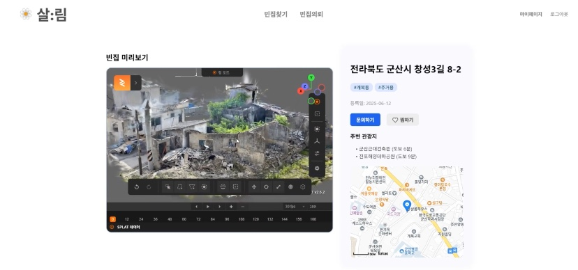

# 🏠 RevitalizeEmptyHomes

군산 지역 빈집 데이터를 수집하고, 지도 기반 시각화 및 POI 분석 기능을 제공하는 플랫폼입니다.  
사용자는 빈집 정보를 등록하고, 주변 인프라 데이터를 기반으로 활용 가능성을 확인할 수 있습니다.  
또한, Gaussian Splatting 기반의 3D 모델링 결과를 연동해 시각적 분석까지 지원합니다.

<br>

## 📌 주요 기능

- **사용자 인증**: 회원가입 및 로그인 기능이 있으며, 로그인한 사용자만 빈집 등록 기능을 사용할 수 있습니다.
- **빈집 등록 및 지도 기반 조회**: 사용자가 빈집의 사진/영상 및 기본 정보를 입력하면 지도에 핀으로 표시됩니다.
- **빈집 상세 정보 확인**: 상세 페이지에서 해당 빈집의 3D 모델, 설명, 주변 인프라 등을 확인할 수 있습니다.
- **POI(주변 인프라) 연동**: Kakao Local API를 통해 마트, 관광지, 공원 등 주변 인프라 데이터를 수집하고, 빈집과의 거리도 함께 계산합니다.
- **3D 모델링 연동**: 사용자가 업로드한 이미지를 기반으로 Colab에서 Gaussian Splatting을 수행하고, 그 결과를 `Back/images/` 경로에 저장합니다.

<br>

## 🧑‍💻 기술 스택

- **Frontend**: React, Vite, TailwindCSS
- **Backend**: FastAPI, SQLite, SQLAlchemy
- **API 연동**: Kakao Local API
- **3D 처리**: Gaussian Splatting (Google Colab 연동)

<br>

## 📁 프로젝트 구조
```csharp
RevitalizeEmptyHomes/
└── EmptyHouse/
    ├── Back/
    │   ├── api/                  # FastAPI 라우터 정의
    │   ├── data/                 # POI 수집 관련 CSV 및 결과 저장
    │   ├── images/               # 사용자 이미지 및 Colab 결과 저장
    │   ├── models/               # SQLAlchemy ORM 모델 정의
    │   ├── outputs/              # 중간 산출물 디렉토리
    │   ├── results/              # Colab 결과 저장
    │   ├── routes/               # 라우팅 함수
    │   ├── scripts/              # POI 수집 스크립트 등
    │   ├── services/             # DB 및 외부 기능 처리
    │   ├── database.py           # DB 세션 및 초기화
    │   ├── main.py               # FastAPI 앱 엔트리포인트
    │   ├── requirements.txt      # 의존성 목록
    │   └── users.db              # SQLite DB 파일
    └── Front/
        ├── public/               # 정적 자원 (favicon, 이미지 등)
        ├── src/
        │   ├── components/       # Layout 컴포넌트
        │   ├── contexts/         # AuthContext, PropertyContext
        │   └── pages/            # 홈, 로그인, 빈집 등록, 상세 등 페이지 구성
        ├── App.js                # 전체 라우팅 및 레이아웃 구성
        └── App.test.js           # 테스트 파일
```

<br>

## 🚀 실행 방법

#### 프론트엔드 실행

```bash
cd Front
npm install
npm run dev
```

#### 백엔드 실행

```bash
cd Back
pip install -r requirements.txt
uvicorn main:app --reload
```  

<br>

## 📸 실행 화면

#### 🧭 빈집 상세 페이지 (3D 모델링 결과 포함)


<br>

## 👤 기여자
- **김서경** - 프론트엔드 개발, UI/UX 설계, 발표 자료(PPT) 및 포스터 제작, 문서 작업
- **서규택** - 백엔드 개발, Gaussian Splatting 기반 3D 모델링 구현 및 Colab 연동
- **오한슬** - 프론트엔드 개발, UI/UX 설계, 빈집 사진 촬영
- **이현서** - 백엔드 개발, 빈집·POI 데이터 수집 및 정제, 서버 최적화, 발표

<br>